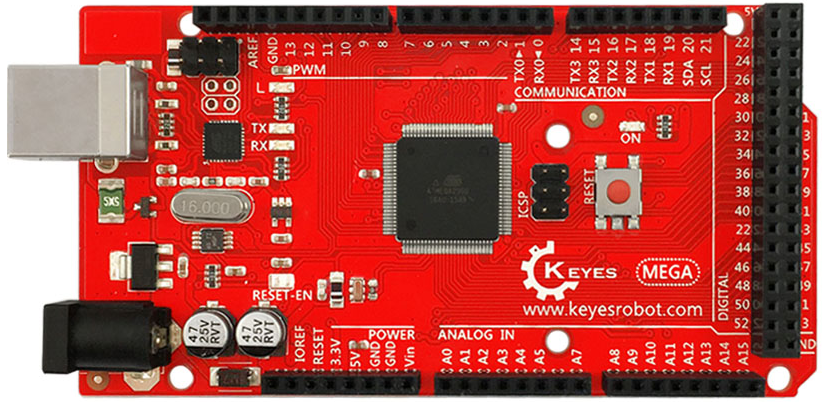
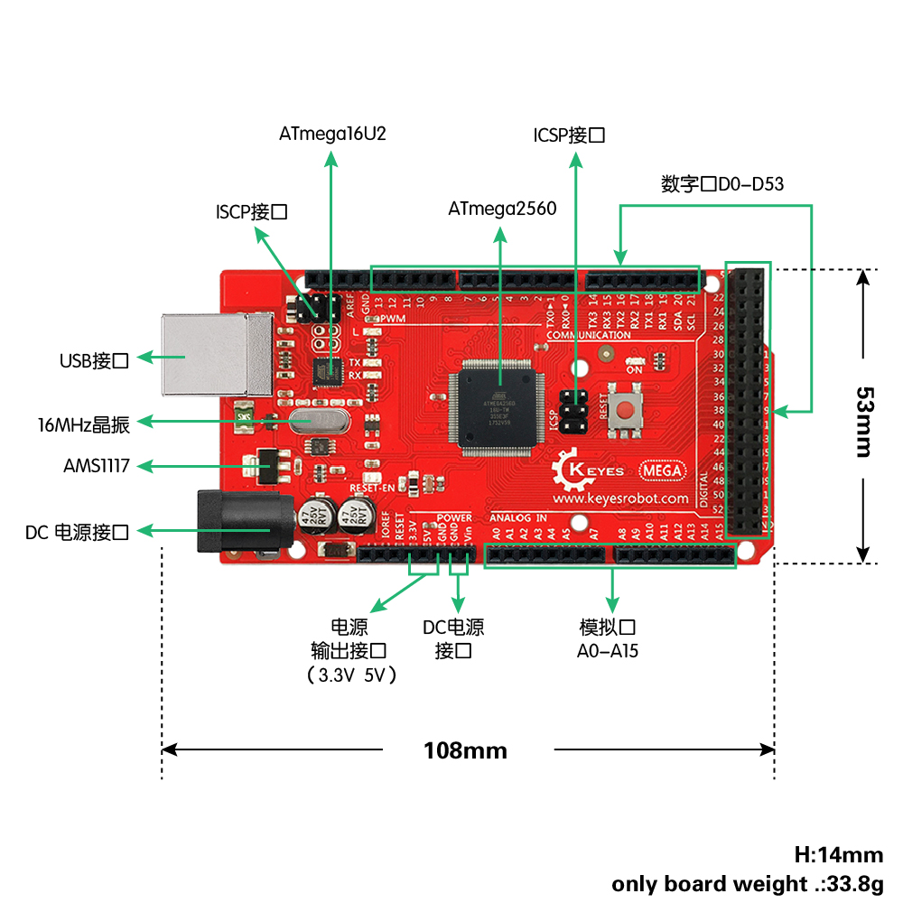
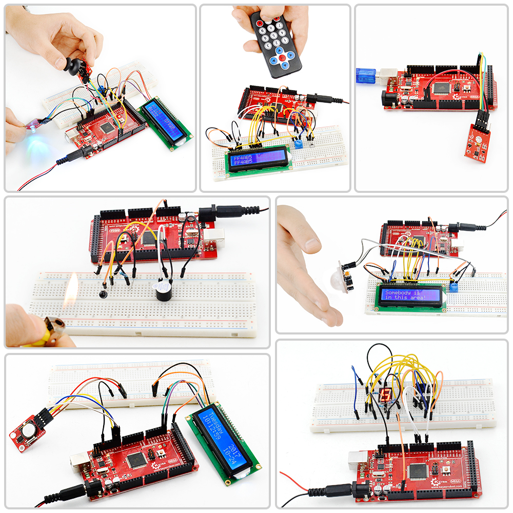

### KE0002 Keyes MEGA 2560 R3 开发板



---

#### **1. 概述**

Keyes MEGA 2560 R3 是一款基于 Arduino MEGA 2560 的兼容开发板，专为需要更多 I/O 引脚、更大存储空间和更强性能的项目设计。它采用开源设计，完全兼容 Arduino 的硬件和软件生态，支持多种传感器模块和扩展板。Keyes MEGA 2560 R3 是电子开发、机器人控制、物联网项目和复杂系统开发的理想选择。

Keyes MEGA 2560 R3 的核心是 ATmega2560 微控制器，配备 ATmega16U2 作为 USB 转串口芯片，支持 USB 通信和 HID 模拟功能（如键盘、鼠标、MIDI 等）。它提供丰富的数字和模拟接口，支持多种通信协议（如 I2C、SPI、UART），适合各种复杂电子项目开发。

---

#### **2. 特点**
1. **更多引脚**：提供 54 个数字 I/O 引脚（其中 15 个支持 PWM 输出）和 16 个模拟输入引脚，适合复杂项目开发。
2. **大容量存储**：配备 256KB 闪存、8KB SRAM 和 4KB EEPROM，支持更大程序和数据存储。
3. **兼容性强**：完全兼容 Arduino MEGA 2560 的硬件和软件，支持 Arduino IDE 编程。
4. **高性价比**：相比原版 Arduino MEGA 2560，价格更实惠，适合大规模教学和项目开发。
5. **稳定性好**：采用高质量元器件，确保开发板运行稳定。
6. **板载 LED 指示灯**：便于调试和状态指示。
7. **USB 转串口芯片**：采用 ATmega16U2，支持 USB 转串口通信，并可模拟 USB HID 设备（如键盘、鼠标、MIDI 等）。

---

#### **3. 规格参数**
- **主控芯片**：ATmega2560 微控制器  
- **USB 转串口芯片**：ATmega16U2  
- **供电方式**：
  - USB 供电：5V  
  - 外接电源：7-12V（建议 9V）  
- **引脚配置**：
  - 数字输入/输出引脚：54 个（其中 15 个支持 PWM 输出）  
  - 模拟输入引脚：16 个  
- **存储**：
  - 闪存：256KB（其中 8KB 用于引导加载程序）  
  - SRAM：8KB  
  - EEPROM：4KB  
- **时钟频率**：16MHz  
- **电源输出**：
  - 3.3V 和 5V 输出接口，用于外部模块供电  
- **复位按键**：支持手动复位  

---

#### **4. 接口功能**
1. **数字引脚 D0-D53**：
   - 串口通信：D0 (RX) 和 D1 (TX)（串口 0）  
   - 外部中断：D2、D3、D18、D19、D20、D21  
   - PWM 输出：D2、D3、D4、D5、D6、D7、D8、D9、D10、D11、D12、D13、D44、D45、D46  
   - SPI 通信：D50 (MISO)、D51 (MOSI)、D52 (SCK)、D53 (SS)  
   - LED：D13 驱动板载 LED  
2. **模拟引脚 A0-A15**：
   - I2C 通信：A4 (SDA) 和 A5 (SCL)  
   - 可作为数字引脚使用：A0(D54)、A1(D55)、A2(D56)、A3(D57)、A4(D58)、A5(D59) 等  
3. **串口接口**：
   - 串口 0：D0 (RX) 和 D1 (TX)  
   - 串口 1：D19 (RX) 和 D18 (TX)  
   - 串口 2：D17 (RX) 和 D16 (TX)  
   - 串口 3：D15 (RX) 和 D14 (TX)  
4. **ICSP 接口**：用于烧录固件或扩展功能  
5. **USB 接口**：用于程序下载和串口调试  
6. **DC 电源接口**：支持 7V-12V 输入  
7. **电源输出接口**：提供 3.3V 和 5V 输出，用于外部模块供电或共地处理。



---

#### **5. 适用场景**
- **电子学习与教学**：适合初学者和进阶用户学习 Arduino 编程和电子电路设计。  
- **机器人控制**：用于控制多个电机、舵机和传感器的复杂机器人项目。  
- **物联网项目开发**：如智能家居、环境监测、远程控制等。  
- **传感器数据采集**：连接多个传感器模块进行数据采集和处理。  
- **复杂 DIY 创意项目**：实现个人创意，如 LED 灯光秀、音乐控制、自动化系统等。  



---

#### **6. 怎么使用**
##### **1. 下载软件**
- 从 [Arduino 官网](https://www.arduino.cc/) 下载 Arduino IDE，并根据操作系统安装（支持 Windows、Mac 和 Linux）。

##### **2. 安装驱动**
- 如果开发板未被电脑识别，可能需要手动安装 Arduino 官方驱动。
- 驱动安装步骤：
  1. 将开发板通过 USB 数据线连接到电脑。
  2. 打开设备管理器，查看是否识别到开发板。
  3. 如果未识别，下载并安装 Arduino 官方驱动。

##### **3. Arduino IDE 介绍**
- **主要功能**：
  - **代码编辑器**：用于编写和编辑 Arduino 程序。
  - **串口监视器**：用于调试和查看开发板的串口输出。
  - **示例代码**：内置丰富的示例代码，适合初学者快速上手。
- **常用菜单**：
  - **工具 -> 开发板**：选择开发板类型（选择 Arduino MEGA 2560）。
  - **工具 -> 端口**：选择开发板对应的串口（如 COM3）。

##### **4. 上传代码**
1. 打开 Arduino IDE，选择 **文件 -> 示例 -> Basics -> Blink**。
2. 点击上传按钮，将代码烧录到开发板。
3. 上传完成后，开发板上的 LED（D13）会开始闪烁。

---

#### **7. 测试代码**
以下是一个简单的测试代码，用于点亮开发板上的板载 LED（连接到 D13 引脚）并让其以 1 秒的间隔闪烁：

```cpp
// 测试代码：让板载 LED 闪烁
void setup() {
  pinMode(13, OUTPUT); // 设置 D13 引脚为输出模式
}

void loop() {
  digitalWrite(13, HIGH); // 点亮 LED
  delay(1000);            // 延迟 1 秒
  digitalWrite(13, LOW);  // 熄灭 LED
  delay(1000);            // 延迟 1 秒
}
```

**步骤：**
1. 打开 Arduino IDE，将上述代码复制到编辑器中。
2. 点击上传按钮，将代码烧录到开发板。
3. 上传完成后，观察板载 LED（D13）以 1 秒的间隔闪烁。

---

#### **8. 注意事项**
1. **供电电压**：
   - 确保外接电源电压在 7-12V 范围内，推荐使用 9V 电源适配器。
2. **USB 数据线**：
   - 使用高质量 USB 数据线，避免因线材问题导致通信失败。
3. **驱动安装**：
   - 如果开发板未被识别，需安装 Arduino 官方驱动。
4. **引脚电流限制**：
   - 单个 I/O 引脚最大电流为 40mA，避免过载损坏引脚。
5. **避免短路**：
   - 在连接外部模块时，确保接线正确，避免短路或反接。
6. **固件烧录**：
   - 如果需要重新烧录 Bootloader，请使用 ICSP 接口。
7. **调试时注意**：
   - D0 和 D1 引脚用于串口通信，调试时避免占用这两个引脚。

---
#### **9. 参考链接**
- **Arduino 官网**：[https://www.arduino.cc/](https://www.arduino.cc/)  
- **Keyes 官网**：[http://www.keyes-robot.com/](http://www.keyes-robot.com/)  
- **Keyes 天猫旗舰店**：[https://keyes.tmall.com/](https://keyes.tmall.com/)  
- **Arduino IDE 下载**：[https://www.arduino.cc/en/software](https://www.arduino.cc/en/software)   

Keyes MEGA 2560 R3 是一款功能强大、易于使用的开发板，非常适合电子开发初学者和进阶用户快速上手 Arduino 项目开发。通过其丰富的接口和强大的兼容性，用户可以轻松实现各种复杂的创意项目。

