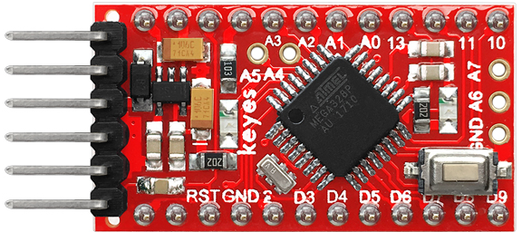
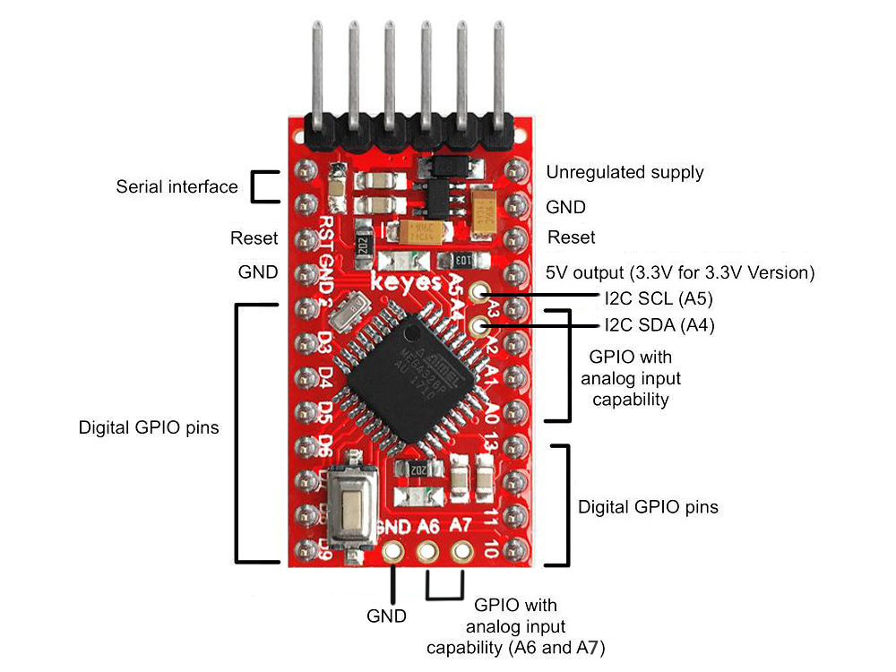

### KE0005 Keyes Pro Mini 开发板

---

#### **1. 概述**
KE0005 Keyes Pro Mini 是一款基于 Arduino Pro Mini 的兼容开发板，专为小型化、低功耗项目设计。它采用 ATmega328P 微控制器，具有强大的性能和丰富的接口，适合嵌入式开发和空间受限的项目。Keyes Pro Mini 提供 3.3V 和 5V 两种版本，用户可以根据项目需求选择合适的电压版本。

由于其小巧的尺寸和低功耗特性，Keyes Pro Mini 非常适合需要便携性和高效能的应用场景，如可穿戴设备、无线传感器网络和物联网（IoT）项目。

---

#### **2. 特点**
1. **小巧轻便**：尺寸仅为 33mm x 18mm，非常适合空间受限的项目。
2. **低功耗设计**：支持低功耗模式，适合电池供电的应用。
3. **高性能微控制器**：采用 ATmega328P，支持 16MHz 时钟频率（5V 版本）或 8MHz 时钟频率（3.3V 版本）。
4. **丰富的接口**：提供 14 个数字 I/O 引脚（其中 6 个支持 PWM 输出）和 8 个模拟输入引脚。
5. **兼容性强**：完全兼容 Arduino IDE 和 Arduino Pro Mini 的硬件生态。
6. **多种供电方式**：支持外部电源输入（RAW 引脚）和直接供电（VCC 引脚）。
7. **经济实惠**：相比其他开发板，价格更低，适合大规模教学和项目开发。

---

#### **3. 规格参数**
- **主控芯片**：ATmega328P  
- **工作电压**：
  - 5V 版本：支持 16MHz 时钟频率  
  - 3.3V 版本：支持 8MHz 时钟频率  
- **供电方式**：
  - 外部电源输入（RAW 引脚）：3.3V-12V  
  - 直接供电（VCC 引脚）：3.3V 或 5V  
- **数字 I/O 引脚**：14 个（其中 6 个支持 PWM 输出）  
- **模拟输入引脚**：8 个（A0-A7）  
- **存储**：
  - 闪存：32KB（其中 0.5KB 用于引导加载程序）  
  - SRAM：2KB  
  - EEPROM：1KB  
- **时钟频率**：
  - 16MHz（5V 版本）  
  - 8MHz（3.3V 版本）  

---

#### **4. 接口功能**
1. **数字引脚 D0-D13**：
   - 串口通信：D0 (RX) 和 D1 (TX)  
   - 外部中断：D2（中断 0）和 D3（中断 1）  
   - PWM 输出：D3、D5、D6、D9、D10 和 D11  
   - SPI 通信：D10 (SS)、D11 (MOSI)、D12 (MISO)、D13 (SCK)  
2. **模拟引脚 A0-A7**：
   - A0-A5：标准模拟输入引脚  
   - A6 和 A7：仅支持模拟输入，不可用作数字引脚  
3. **电源引脚**：
   - **RAW**：外部电源输入（3.3V-12V）  
   - **VCC**：直接供电（3.3V 或 5V，取决于版本）  
   - **GND**：接地  
4. **复位引脚**：用于手动复位开发板  
5. **ICSP 接口**：用于烧录 Bootloader 或扩展功能  

---

#### **5. 适用场景**
- **可穿戴设备**：如智能手环、健康监测设备等。
- **无线传感器网络**：用于采集和传输环境数据。
- **物联网（IoT）项目**：如智能家居、远程监控等。
- **机器人控制**：控制电机、舵机等执行器。
- **便携式设备**：如便携式数据记录器、GPS 跟踪器等。
- **教学与学习**：适合初学者学习 Arduino 编程和电子电路设计。

---

#### **6. 怎么使用**
##### **1. 下载软件**
- 从 [Arduino 官网](https://www.arduino.cc/) 下载 Arduino IDE，并根据操作系统安装（支持 Windows、Mac 和 Linux）。

##### **2. 安装驱动**
- Keyes Pro Mini 没有板载 USB 转串口芯片，需要使用外部 USB 转串口模块（如 FT232、CP2102 或 CH340）进行通信。
- 根据所使用的 USB 转串口模块，安装对应的驱动程序：
  - **FT232**：[FTDI 官方驱动下载](https://ftdichip.com/drivers/)  
  - **CP2102**：[Silicon Labs 官方驱动下载](https://www.silabs.com/developers/usb-to-uart-bridge-vcp-drivers)  
  - **CH340**：[CH340 驱动下载](http://www.wch.cn/downloads/category/24.html)  

##### **3. Arduino IDE 介绍**
- **主要功能**：
  - **代码编辑器**：用于编写和编辑 Arduino 程序。
  - **串口监视器**：用于调试和查看开发板的串口输出。
  - **示例代码**：内置丰富的示例代码，适合初学者快速上手。
- **常用菜单**：
  - **工具 -> 开发板**：选择开发板类型（选择 Arduino Pro or Pro Mini）。
  - **工具 -> 处理器**：根据开发板版本选择处理器（ATmega328P (5V, 16MHz) 或 ATmega328P (3.3V, 8MHz)）。
  - **工具 -> 端口**：选择 USB 转串口模块对应的串口（如 COM3）。

##### **4. 上传代码**
1. 使用 USB 转串口模块将 Keyes Pro Mini 开发板连接到电脑：
   - **GND -> GND**  
   - **VCC -> VCC**（根据开发板版本选择 3.3V 或 5V）  
   - **RX -> TX**  
   - **TX -> RX**  
   - **DTR -> RST**（用于自动复位）  
2. 打开 Arduino IDE，选择 **文件 -> 示例 -> Basics -> Blink**。
3. 点击上传按钮，将代码烧录到开发板。
4. 上传完成后，观察板载 LED（D13）以 1 秒的间隔闪烁。

---

#### **7. 注意事项**
1. **供电电压**：
   - 确保外部电源输入电压在 3.3V-12V 范围内，避免损坏开发板。
2. **USB 转串口模块**：
   - 使用高质量的 USB 转串口模块，确保通信稳定。
3. **驱动安装**：
   - 根据所使用的 USB 转串口模块，安装对应的驱动程序。
4. **引脚电流限制**：
   - 单个 I/O 引脚最大电流为 40mA，避免过载损坏引脚。
5. **避免短路**：
   - 在连接外部模块时，确保接线正确，避免短路或反接。
6. **复位引脚**：
   - 如果上传代码失败，可尝试在上传过程中手动按下复位按钮。
7. **选择正确的开发板和处理器**：
   - 在 Arduino IDE 中，根据开发板的电压和频率选择正确的处理器。

---

#### **8. 参考链接**
- **Arduino 官网**：[https://www.arduino.cc/](https://www.arduino.cc/)  
- **Keyes 官网**：[http://www.keyes-robot.com/](http://www.keyes-robot.com/)  
- **FT232 驱动下载**：[https://ftdichip.com/drivers/](https://ftdichip.com/drivers/)  
- **CP2102 驱动下载**：[https://www.silabs.com/developers/usb-to-uart-bridge-vcp-drivers](https://www.silabs.com/developers/usb-to-uart-bridge-vcp-drivers)  
- **CH340 驱动下载**：[http://www.wch.cn/downloads/category/24.html](http://www.wch.cn/downloads/category/24.html)  
- **Arduino IDE 下载**：[https://www.arduino.cc/en/software](https://www.arduino.cc/en/software)  

---

Keyes Pro Mini 是一款小巧、低功耗的开发板，非常适合嵌入式开发和便携式项目。通过其丰富的接口和强大的兼容性，用户可以轻松实现各种创意项目。

