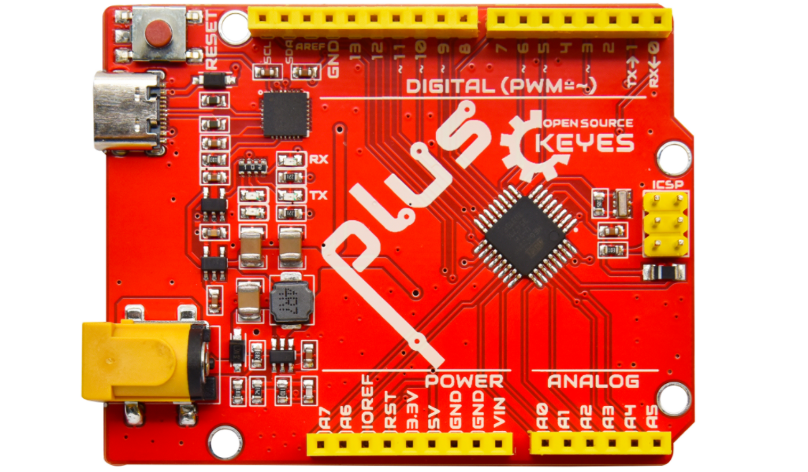
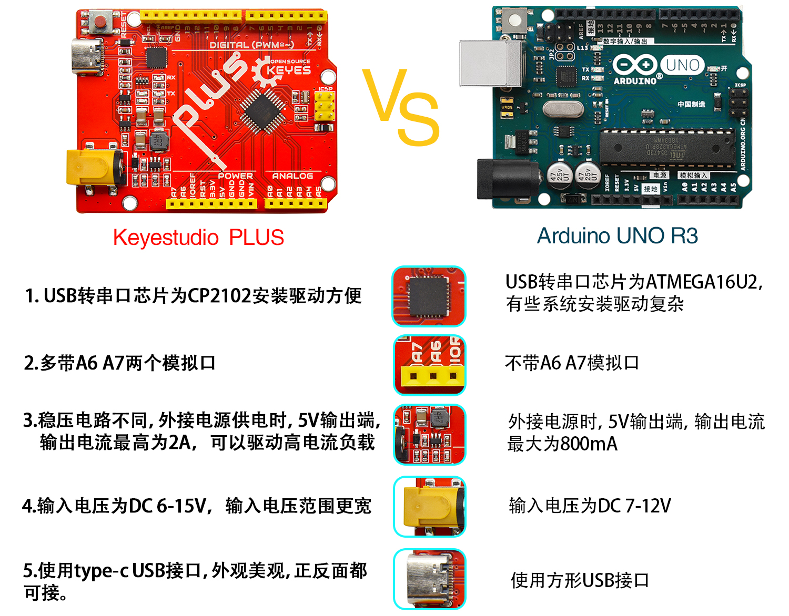
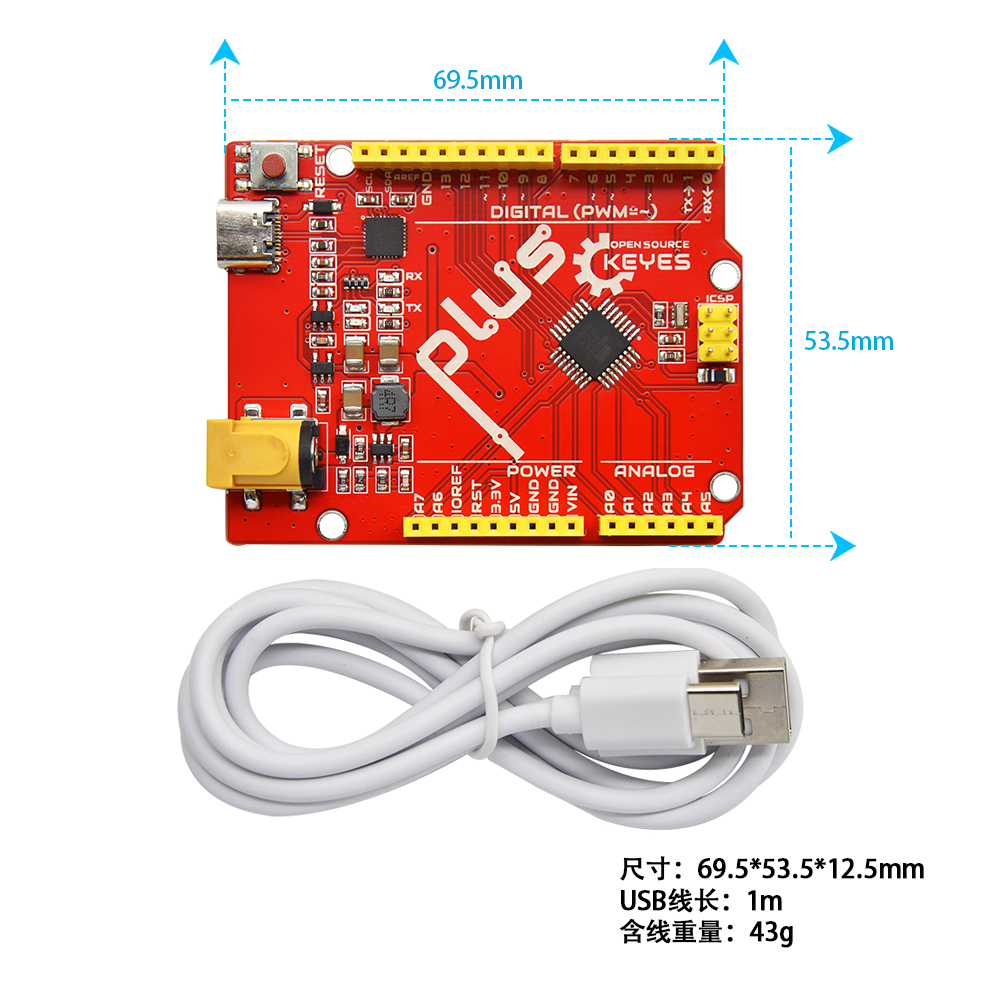
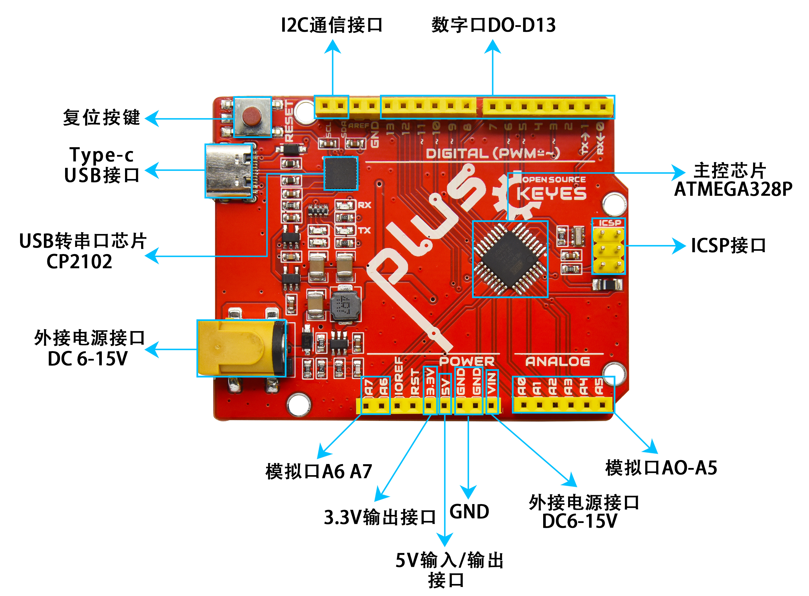
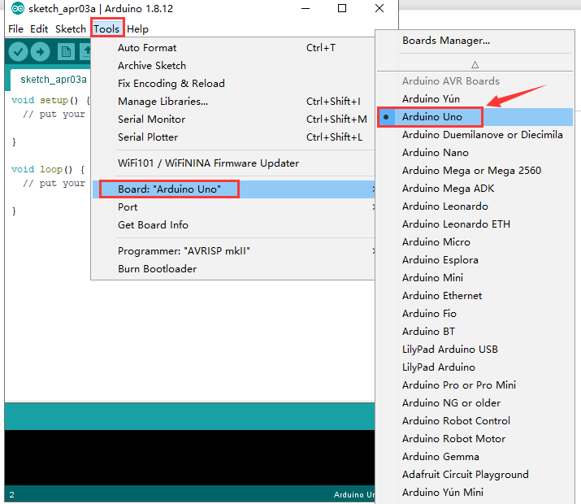
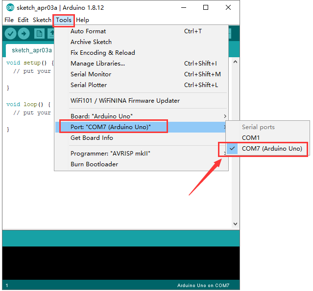
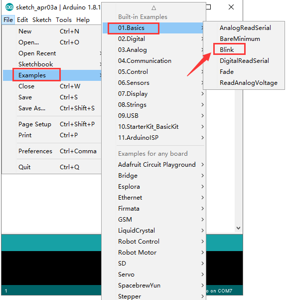
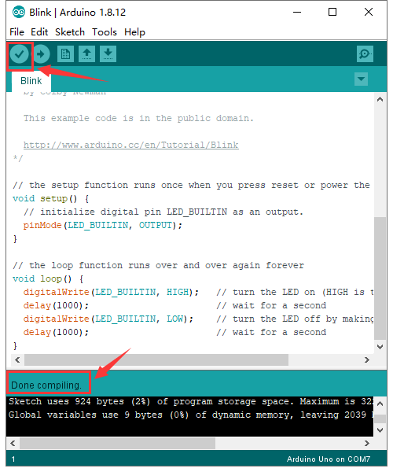
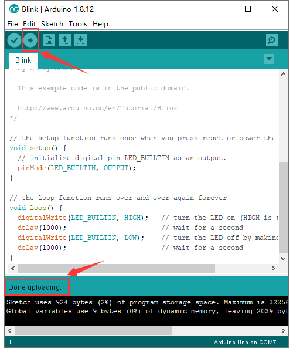

# KE0171 Keyes Uno Plus 开发板



---

## 1. 说明
Keyes Uno Plus 开发板是一款完全兼容 Arduino IDE 开发环境的控制板，适用于 DIY 电子产品实验。它包含官网的 UNO R3 板的所有功能，并在此基础上进行了改进，使其功能更加强大。为了方便接线，配备了一根长度为 1 米的 Type-C 接口 USB 线。



---

## 2. 规格参数



- **微控制器**：ATMEGA328P-AU  
- **USB 转串口芯片**：CP2102  
- **工作电压**：DC 5V  
- **外接电源**：DC 6-15V（建议 9V）  
- **数字 I/O 引脚**：14 (D0-D13)  
- **PWM 通道**：6 (D3, D5, D6, D9, D10, D11)  
- **模拟输入通道（ADC）**：8 (A0-A7)  
- **每个 I/O 直流输出能力**：20 mA  
- **3.3V 端口输出能力**：50 mA  
- **Flash Memory**：32 KB（其中引导程序使用 0.5 KB）  
- **SRAM**：2 KB (ATMEGA328P-AU)  
- **EEPROM**：1 KB (ATMEGA328P-AU)  
- **时钟速度**：16 MHz  
- **板载 LED 引脚**：D13  

---

## 3. 各个接口和主要元件说明
- **数字 I/O 引脚**：用于连接各种传感器和执行器。
- **PWM 引脚**：用于输出模拟信号，控制电机速度和 LED 亮度。
- **模拟输入引脚**：用于读取模拟信号，如温度传感器的输出。
- **USB 接口**：用于与计算机连接，供电和数据传输。
- **电源接口**：用于外接电源供电。



---

## 4. 特殊功能接口说明
- **串口通信接口**：D0 为 RX、D1 为 TX。
- **PWM 接口（脉宽调制）**：D3, D5, D6, D9, D10, D11。
- **外部中断接口**：D2 (中断0) 和 D3 (中断1)。
- **SPI 通信接口**：D10 为 SS、D11 为 MOSI、D12 为 MISO、D13 为 SCK。
- **IIC 通信端口**：A4 为 SDA、A5 为 SCL。

---

## 5. 配置开发环境

### 5.1 安装 Arduino IDE

#### 在 Windows 系统上
1. 访问 [Arduino 官网](https://www.arduino.cc/en/software)。
2. 下载适合 Windows 的 Arduino IDE 安装程序（.exe 文件）。
3. 双击下载的文件，按照提示完成安装。

#### 在 macOS 系统上
1. 访问 [Arduino 官网](https://www.arduino.cc/en/software)。
2. 下载适合 macOS 的 Arduino IDE 安装包（.dmg 文件）。
3. 打开下载的文件，拖动 Arduino IDE 到应用程序文件夹中。

---

### 5.2 安装驱动程序

#### Windows 系统
1. 将 Keyes Uno Plus 开发板通过 USB 线连接到电脑。
2. Windows 会自动识别并安装 CP2102 驱动。如果未成功安装，打开设备管理器，找到 CP2102，右键选择“更新驱动程序”。
3. 浏览计算机查找驱动程序，选择 Arduino IDE 安装目录下的 `drivers` 文件夹，完成驱动安装。

#### macOS 系统
1. 下载 CP2102 驱动：[Silicon Labs 驱动下载](https://www.silabs.com/developers/usb-to-uart-bridge-vcp-drivers)。
2. 解压下载的压缩包，双击 `SiLabsUSBDriverDisk.dmg` 文件。
3. 双击 `Install CP210x VCP Driver`，按照提示完成安装。

---

### 5.3 设置 Arduino IDE

#### 启动 Arduino IDE
1. 打开 Arduino IDE。

#### 选择开发板
1. 在菜单栏中，点击 `Tools` → `Board` → `Arduino Uno`（选择 Keyes Uno Plus）。

	

#### 选择 COM 口
1. 在菜单栏中，点击 `Tools` → `Port`，选择对应的 COM 口（在设备管理器中查看）。

	

#### 工具栏介绍
- **检查编译错误**：点击对勾图标。
- **上传程序**：点击右箭头图标。
- **新建草图**：点击文件图标。
- **打开示例草图**：点击文件夹图标。
- **保存草图**：点击软盘图标。
- **串行监视器**：点击放大镜图标。

---

### 5.4 启动你的第一个程序
1. 在 Arduino IDE 中，点击 `File` → `Examples` → `01.Basics` → `Blink`。

	

2. 确保选择了正确的开发板和 COM 口。

3. 点击对勾图标检查代码是否有错误。

	

4. 点击右箭头图标上传程序。

	

5. 上传成功后，板载 LED 灯会闪烁，表示程序运行成功。

---

## 6. 示例代码
以下是一个简单的示例代码，用于控制板载 LED 灯闪烁：
```cpp
void setup() {
  pinMode(13, OUTPUT); // 设置 D13 为输出模式
}

void loop() {
  digitalWrite(13, HIGH); // 打开 LED
  delay(1000); // 延时 1 秒
  digitalWrite(13, LOW); // 关闭 LED
  delay(1000); // 延时 1 秒
}
```

---

## 7. 实验现象
按照连接图接好线并烧录代码，上电后，板载 LED 灯会每秒闪烁一次，表示程序运行成功。

---

## 8. 注意事项
- 确保在上传程序之前选择正确的板和 COM 口。
- 在连接外部设备时，注意电源和信号的兼容性，避免损坏开发板。
- 使用外接电源时，确保电压在推荐范围内（6-15V）。

---

## 9. 参考链接
- [Keyes 官方网站](http://www.keyes.com.cn)  
- [Keyes 天猫旗舰店](https://keyes.tmall.com)  
- [Arduino 官方网站](https://www.arduino.cc)  
- [CP2102 驱动下载](https://www.silabs.com/developers/usb-to-uart-bridge-vcp-drivers)  
- [Arduino IDE 下载](https://www.arduino.cc/en/software)  

如有更多疑问，请联系 Keyes 官方客服或加入相关创客社区交流。祝使用愉快！