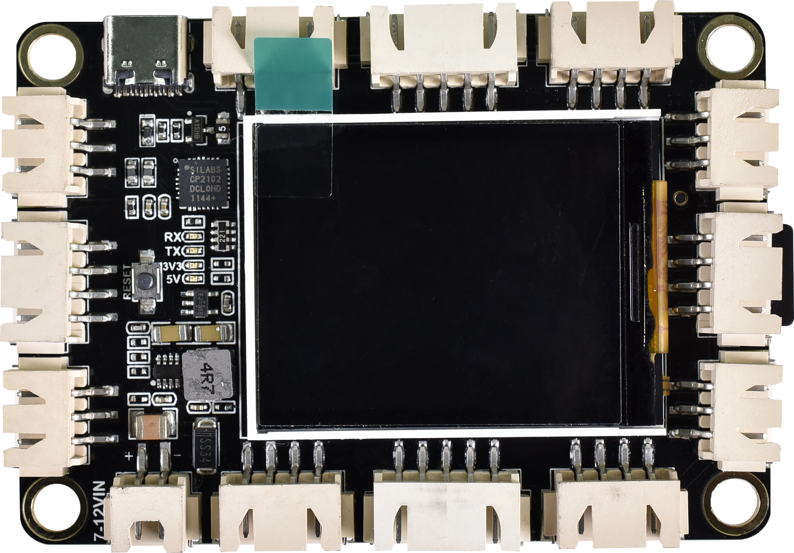
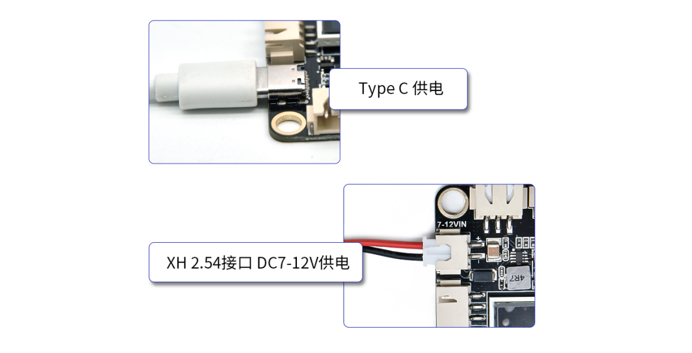
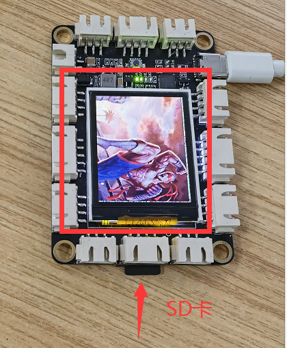

# KE0175 Keyes STEM 电子积木编程教育开发板



---

## 1. 简介
KE0175 Keyes STEM 电子积木编程教育开发板是一款基于 ATmega328P 的单片机开发板，完全兼容 Arduino IDE 开发环境。该开发板集成了一块 1.8 寸 TFT 屏和 SD 卡模块，便于显示实验内容和储存数据。可搭配丰富的 XH2.5 接口扩展使用，外围传感器即插即用，开发板上有四个螺丝定位孔，可搭配电子积木，完成简单的造型和创意性的实验。

---

## 2. 特点
- **兼容性强**：完全兼容 Arduino IDE 开发环境，易于上手。
- **集成显示**：内置 1.8 寸 TFT 屏，方便实时显示数据和信息。
- **扩展性好**：支持 XH2.5 接口，外围传感器即插即用。
- **环保设计**：采用环保材料，安全可靠。
- **多功能**：适合教育、DIY 项目和创意实验。

---

## 3. 规格参数
- **USB 输入电压**：DC 3.3V - 5V  
- **VIN 输入电压**：DC 7~12V  
- **IO 输出电流**：80mA  
- **VCC 输出最大电流**：3A  
- **最大功率**：15W  
- **工作温度范围**：-10~50℃  
- **微控制器**：ATmega328P-AU  
- **USB 转串口芯片**：CP2102  
- **数字 I/O 引脚**：8 (D0-D7)  
- **PWM 通道**：3 (D3、D5、D6)  
- **模拟输入通道（ADC）**：8 (A0-A7)  
- **Flash Memory**：32 KB（其中引导程序使用 0.5 KB）  
- **SRAM**：2 KB (ATmega328P-AU)  
- **EEPROM**：1 KB (ATmega328P-AU)  
- **时钟速度**：16MHz  
---

## 4. 接口
- **USB 接口**：用于供电和编程。
- **VIN 接口**：外部电源输入。
- **数字 I/O 引脚**：用于连接传感器和执行器。
- **PWM 接口**：用于脉宽调制输出。
- **模拟输入引脚**：用于读取模拟信号。
- **SD 卡模块**：用于存储数据和文件。


---

## 5. 连接图



### 引脚定义
- **VCC**：连接到 Arduino 的 5V 引脚。
- **GND**：连接到 Arduino 的 GND 引脚。
- **DATA**：连接到 Arduino 的数字引脚（如 D2）。

---

## 6. 示例代码
以下是一个简单的示例代码，用于读取 SD 卡中的 BMP 图片并在 TFT 屏上显示，同时进行电压测试和流水灯测试：

```cpp
#include "Adafruit_GFX.h"
#include "Adafruit_ST7735.h"
#include <SD.h>
#include <SPI.h>

#if defined(__SAM3X8E__)
    #undef __FlashStringHelper::F(string_literal)
    #define F(string_literal) string_literal
#endif

#define SD_CS    7  // Chip select line for SD card
#define TFT_CS  8  // Chip select line for TFT display
#define TFT_DC   10  // Data/command line for TFT
#define TFT_RST  9  // Reset line for TFT (or connect to +5V)

Adafruit_ST7735 tft = Adafruit_ST7735(TFT_CS, TFT_DC, TFT_RST);

int Delay_Timer = 300;

void setup(void) {
  Serial.begin(9600);
  Pin_Set();
  tft.initR();
  Serial.println("OK!");
  tft.fillScreen(ST7735_BLACK);
  tft.setRotation(45);
  tft.setTextSize(2);
  Serial.print("Initializing SD card...");
  if (!SD.begin(SD_CS)) {
    Serial.println("failed!");
    tft.setTextColor(ST7735_RED);
    tft.setCursor(30, 40);
    tft.print("SD Error");
    return;
  } else {
    Serial.println("SD OK");
    tft.setTextColor(ST7735_RED);
    tft.setCursor(30, 40);
    tft.print("SD OK");
  }
  delay(500);
}

void loop() { 
  Voltage_Test();   // A6/A7 测试 5V 电压
  delay(3000);
  Pin_Test();  // 流水灯测试
  delay(1000);
  Bmp();            // SD 卡读取图片测试
}

void Voltage_Test() {
  tft.setTextSize(1);
  String A6_Value = String(analogRead(A6) * 5.0 / 1023 * 2.0);
  String A7_Value = String(analogRead(A7) * 5.0 / 1023 * 2.0);
  Serial.println(String("A6_Value:") + A6_Value + " V");
  Serial.println(String("A7_Value:") + A7_Value + " V");
  tft.setTextColor(ST7735_BLACK);
  tft.setCursor(10, 80);
  tft.print(String("A6_Value:") + A6_Value + " V");
  tft.setCursor(10, 100);
  tft.print(String("A7_Value:") + A7_Value + " V");
  delay(250);
  tft.setTextColor(ST7735_WHITE);
  tft.setCursor(10, 80);
  tft.print(String("A6_Value:") + A6_Value + " V");
  tft.setCursor(10, 100);
  tft.print(String("A7_Value:") + A7_Value + " V");
}

void Bmp() {
  bmpDraw("car.bmp", 0, 0);
  delay(Delay_Timer);
  bmpDraw("avatar.bmp", 0, 0);
  delay(Delay_Timer);
}

void Pin_Test() {
  for (int i = 0; i < 8; i++) {
    digitalWrite(i, LOW);
    delay(Delay_Timer);
    digitalWrite(i, HIGH);
  }
}

void Pin_Set() {
  for (int i = 0; i < 7; i++) {
    pinMode(i, OUTPUT);
  }
  for (int i = 14; i < 20; i++) {
    pinMode(i, OUTPUT);
  }
  for (int i = 0; i < 7; i++) {
    digitalWrite(i, HIGH);
  }
  for (int i = 14; i < 20; i++) {
    digitalWrite(i, HIGH);
  }
}

#define BUFFPIXEL 20

void bmpDraw(char *filename, uint8_t x, uint8_t y) {
  File bmpFile = SD.open(filename);
  ...
}

uint16_t read16(File f) {
  uint16_t result;
  ((uint8_t *)&result)[0] = f.read(); // LSB
  ((uint8_t *)&result)[1] = f.read(); // MSB
  return result;
}

uint32_t read32(File f) {
  uint32_t result;
  ((uint8_t *)&result)[0] = f.read(); // LSB
  ((uint8_t *)&result)[1] = f.read();
  ((uint8_t *)&result)[2] = f.read();
  ((uint8_t *)&result)[3] = f.read(); // MSB
  return result;
}
```

---

## 7. 实验现象
上传程序后，开发板将读取 SD 卡中的图片并在 TFT 屏上显示内容。如果 SD 卡插入正确且文件存在，屏幕将显示文件内容；如果出现错误，屏幕将显示相应的错误信息。同时，电压测试结果将显示在屏幕上，流水灯测试将依次点亮数字引脚。



---

## 8. 注意事项
- 确保 SD 卡中存在指定的 BMP 文件（如 `car.bmp` 和 `avatar.bmp`）。
- 确保供电电压在 7-12V 范围内，避免损坏开发板。
- 在上传代码之前，确保选择正确的板和 COM 口。
- 使用合适的库文件以确保程序正常运行。

---

## 9. 参考链接
- [Keyes 官方网站](http://www.keyes-robot.com/)  
- [Arduino 官方网站](https://www.arduino.cc)  
- [Adafruit GFX Library](https://github.com/adafruit/Adafruit-GFX-Library)  
- [Adafruit ST7735 Library](https://github.com/adafruit/Adafruit-ST7735-Library)  
- [Arduino SD Library](https://www.arduino.cc/en/Reference/SD)  
- [Arduino SPI Library](https://www.arduino.cc/en/Reference/SPI)  

如有更多疑问，请联系 Keyes 官方客服或加入相关创客社区交流。祝使用愉快！